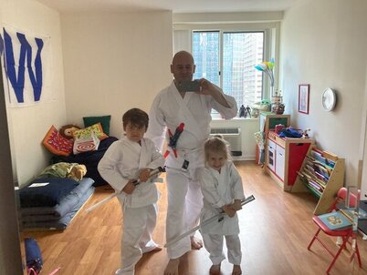
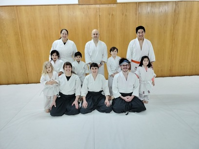
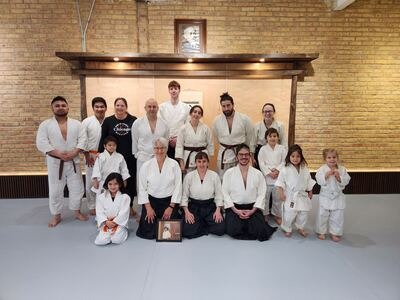
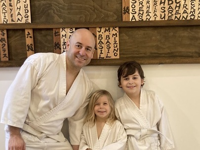
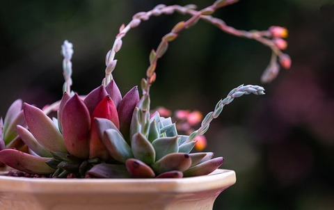

## [Core](https://youtu.be/0lvK1YDTi1Q)

[Aikido](https://www.youtube.com/watch?v=vf1etlfrXmY) is *shugyo*:

* *Intense physical and spiritual training*
* *To perfect human character*
* *Develop true wisdom*

### Aspects

* [Warriors of Budo](https://www.youtube.com/watch?v=-lC2yMhXNME)
* [Relativity of Yin and Yang](https://www.youtube.com/watch?v=hC_YSD2F9iY)
* [Tenshinkan Dojo in Chicago](https://japaneseculturecenter.com/classes/aikido/)

## Circuitry

* *Complete circular paths of flow*

### [History of Aikido](https://aaa-aikido.com/history-of-aikido/)

* *True victory is victory over the self*
* *A true warrior is invincible because he or she contests with nothing*
* *One becomes vulnerable when one stops to think about winning*

### [Benefits of Aikido](https://aaa-aikido.com/benefits-of-aikido/)
  
* *Martial artists view conflict as a means to overcome our true enemies, which are within*
* *It is our choice to see this conflict as the creative force of change*
* *Our true dojo is our life itself*

### [Fumio Toyoda Shihan, AAA & AAI Founder](https://aaa-aikido.com/fumio-toyoda-shihan-8/)
  
* *Budo, the martial Way, means to live and to die fully and with full awareness*
* *Aikido is a good path open for anyone*
* *We walk together*

## [Power](https://www.youtube.com/watch?v=ZUxuQC1Ec2A) ⚡

* *Energy investment over time*
* *Combination of potential and flow*
* *Intuition for rechannelling the capacitance of conflict*

### White Level

* *White signifies innocence or purity*

* August 2022

* March 2023

### 8th Kyu - Orange Level

* *Orange signifies continued growth and maturity to the seedling*
* [Ikkyo - First Teaching](https://www.youtube.com/watch?v=RX3Oru_CbKY)
  * "The best general is the general who knows what the other one will do"
    * Christian Tissier

***General Terms:***

Kata

* One or same
* Form or pattern
* Shoulder
* Mold or model
* Method

Kosa

* Cross

Te

* Hand

Tori

* Grab
* To take or capture
* Bird
* Taking or getting, like taking a picture or picking up a new language
* Street

Za

* Seat or cusion
* Group or association, as in common interest
* Position or posture
* Rice planting

[Zen](https://www.youtube.com/watch?v=T_3HiknOtBY)

* Practice of mediation
* Practice of mindfulness
* Living in the present moment
* Direct experience over thinking
* Mental clarity
* Calm, focus and simplicity
* Minimalist aesthetic style

***Ki Exercises:***

Bowing

* Standing bow, bend at the waist
* [Demonstration](https://www.youtube.com/watch?v=5K2riEjHzpE)
* [Details](https://www.youtube.com/watch?v=ZLUVfO951u0)

Seiza

* Sitting Japanese style with legs folded underneath
* [Demonstration](https://www.youtube.com/watch?v=bbFI5vFfEmQ)
* [Details](https://www.youtube.com/watch?v=a6tgV2MNwzc)

Hanmi No Kamae

* *Half-Body* stance
* [Demonstration](https://www.youtube.com/watch?v=dgn5r6kyr1M)

Orenaite

* Unbendable arm, practiced while in hanmi stance
* [Demonstration](https://www.youtube.com/watch?v=JB4AB5Tjl9o)
* [Details](https://www.youtube.com/watch?v=7PFZyYeURtc)

Koho Tento Undo

* Rolling backward and forward from sitting, kneeling and standing positions
* [Demonstration](https://www.youtube.com/watch?v=glR1991blKE)

Shomenuchi

* Overhead strike to the temple
* [Demonstration](https://www.youtube.com/watch?v=C2jKX2NuYsQ)

***Response Techniques:***

Katatori Ikkyo Omote

* *First Teaching*
* Same side lapel grab, ikkyo connection, slide across front, kiza pin
* [Demonstration](https://www.youtube.com/watch?v=ZRhE35jsNNk)

Katatori Ikkyo Ura

* *First Teaching*
* Same side lapel grab, ikkyo connection, step to the back, spin, kiza pin
* [Demonstration](https://www.youtube.com/watch?v=IaTAiQkVoVc)

Katatekosatori Kokyunage

* *Timing Throw*
* Crost hand wrist grab, step to back controlling head, turn in, throw
* [Demonstration](https://www.youtube.com/watch?v=Zzk_lCVvqdM)

Katatekosatori Kotegaeshi

* *Wrist Turning*
* Crost hand wrist grab, step to back, wrist to knee, turn in, wrist to face, roll over, standing pin
* [Demonstration](https://www.youtube.com/watch?v=t_p1sowf5vM)

***Belt Testing:***

Community:

Board:

Highlights:

* [March 2023 - Jack and Dad](https://www.youtube.com/watch?v=VvirYiT8etI)

### 7.5 Kyu - Orange Stripe Level

* *Orange with stripe induces the spirit of the tiger*

***General Terms:***

Funa/fune

* Boat
* Ship
* Vessel

Kogi/kogu

* Paddling
* Propelling
* Rowing

Mune

* Chest or breast area of the body
* Ribcage, sternum, and or pectoral muscles

Tsuki

* Thrust
* Punch
* Moon

Undo

* Exercise
* Motion
* Movement

***Ki Exercises:***

Shizentai

* Standing natural stance
* [Demonstration](https://www.youtube.com/watch?v=p5jDEB8VLBw)
* [Details](https://www.youtube.com/watch?v=CgK2xbzhVRM)

Agura No Shisei

* Sitting cross-legged
* [Demonstration](https://www.youtube.com/watch?v=MrACEN-MEhY)

Funakogi Undo

* *Boat rowing* exercise
* [Demonstration](https://www.youtube.com/watch?v=UN5azGRX3cs)
* [Details](https://www.youtube.com/watch?v=tdUWD4Z8I2E)

Munetsuki

* Punch straight to the chest
* [Demonstration](https://www.youtube.com/watch?v=dGaARvulpiM)

***Response Techniques:***

Shomenuchi Kokyunage

* Overhead strike attack, step to back controlling head, turn in, throw
* [Demonstration](https://www.youtube.com/watch?v=wIIf60uaYcM)

Katatetori Shihonage Omote

* *Four-Direction Throw*
* Taking control of arm, slide across front, circle above head, throw
* [Demonstration](https://www.youtube.com/watch?v=KSPsBjH_t1s)

Katatetori Shihonage Ura

* *Four-Direction Throw*
* Taking control of arm, step to the back, circle above head, throw
* [Demonstration](https://www.youtube.com/watch?v=iEXhbhSLEoo)

Katatetori Nikyo Omote

* Same side hand grab, nikyo connection, slide across front, control down, elbow cradle pin
* [Demonstration](https://www.youtube.com/watch?v=DSbaa9rzwYY)

Katatetori Nikyo Ura

* Same side hand grab, nikyo connection, step to the back, control down, elbow cradle pin
* [Demonstration](https://www.youtube.com/watch?v=ZzwkluvYgok)

## Spirit

* Purity
* Rebirth
* Strength

### Arcs

* [Belt Testing](https://aikido-dojo.org/the-dojo/test-requirements/)
* [Chushinkan Dojo - Video Demonstrations](http://www.chushinkan.com/video.html)
* [Aikido of Northwest Kansas - Video Demonstrations](https://www.youtube.com/@aikidoofnorthwestkansas6804)
* [AikiWeb - The Source for Aikido Information](http://www.aikiweb.com/)
* [Aikido and the Dynamic Sphere](https://www.amazon.com/gp/product/0804832846/ref=ppx_yo_dt_b_search_asin_title)
* [Budo - Teachings of the Founder of Aikido](https://www.amazon.com/Budo-Teachings-Founder-Morihei-Ueshiba/dp/1568364873)
* [Zen Connections](https://isha.sadhguru.org/us/en/wisdom/article/zen-and-yoga)
* [Fox Forrest Zen](https://www.foxforestzen.org/)

[🌿🌀🎨](https://link.basil.one)
