## Egg

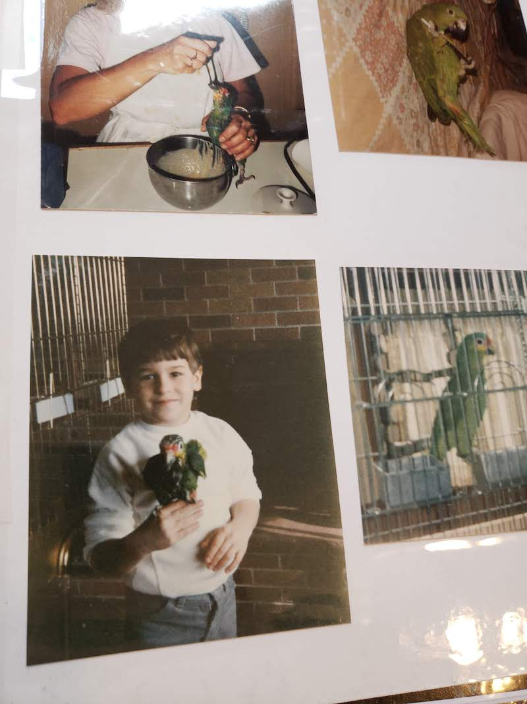

## Hatch

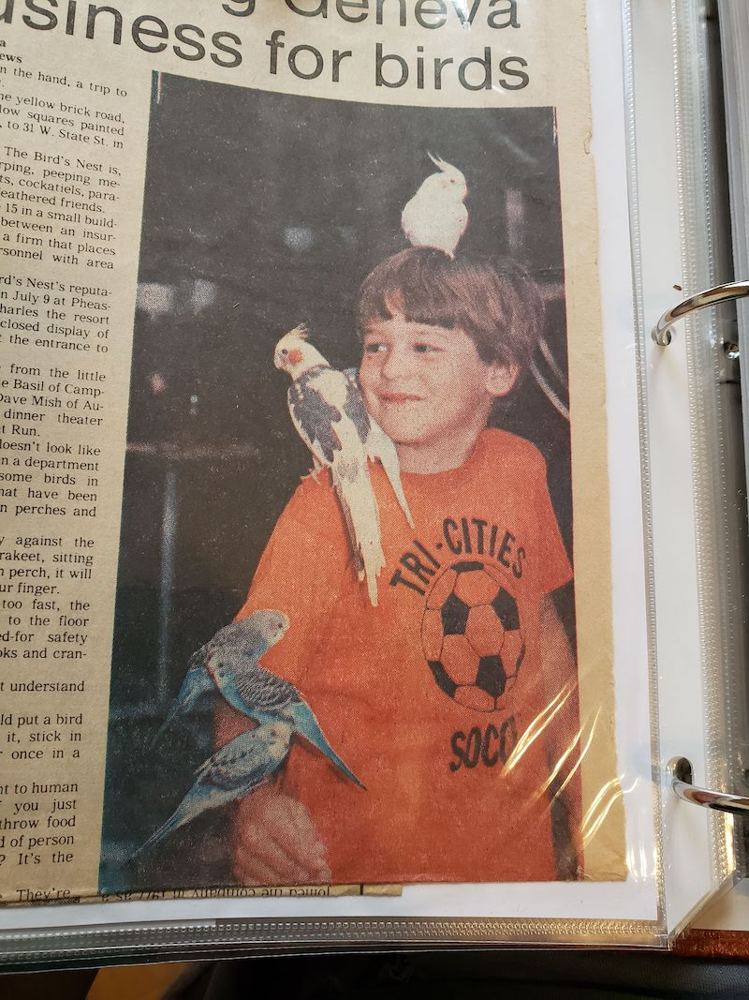

## Raise

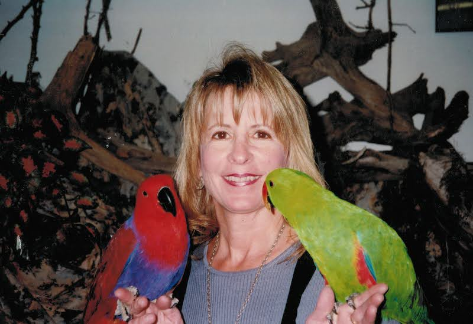
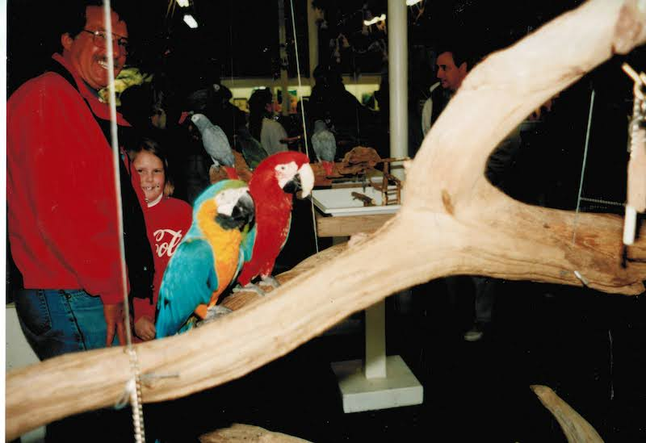
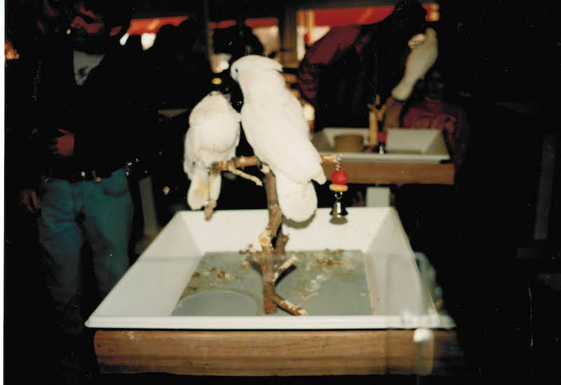
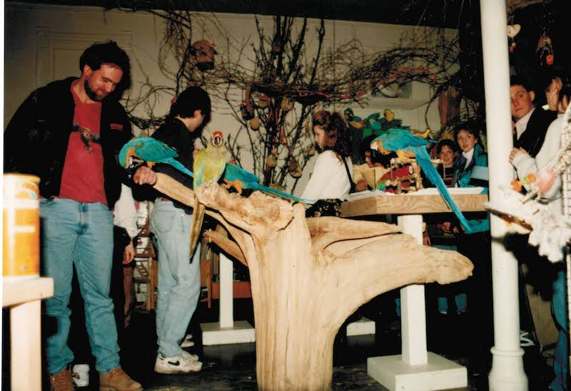
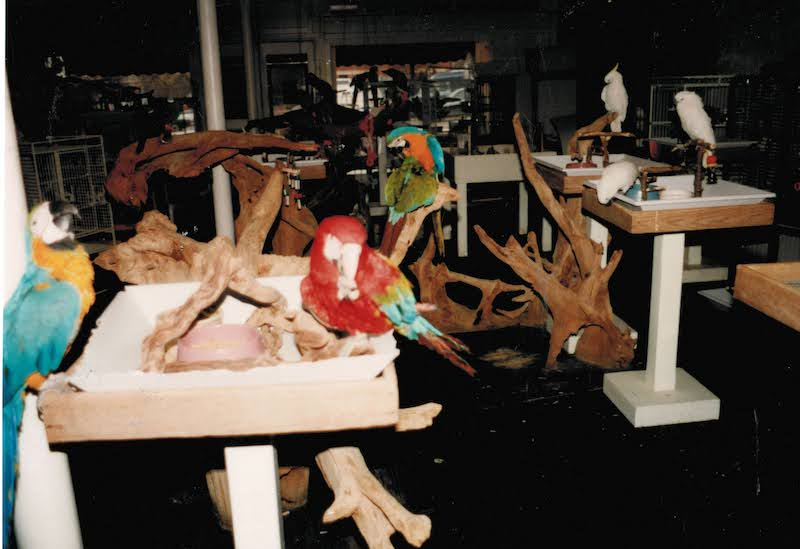
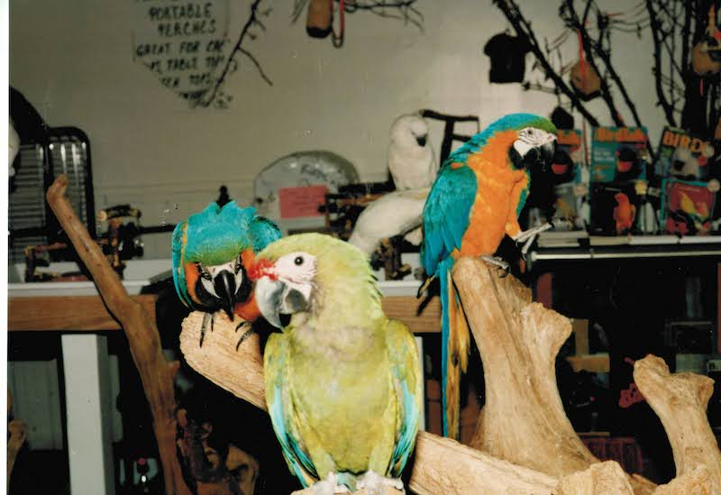
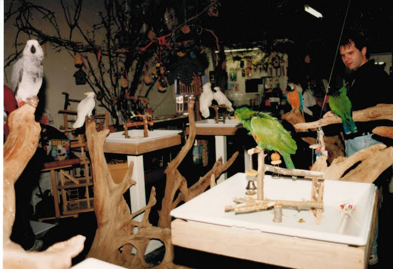
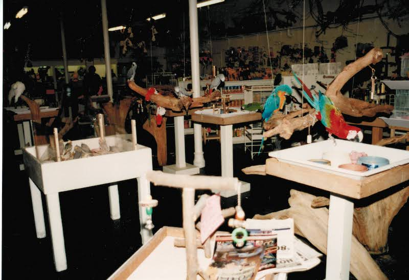
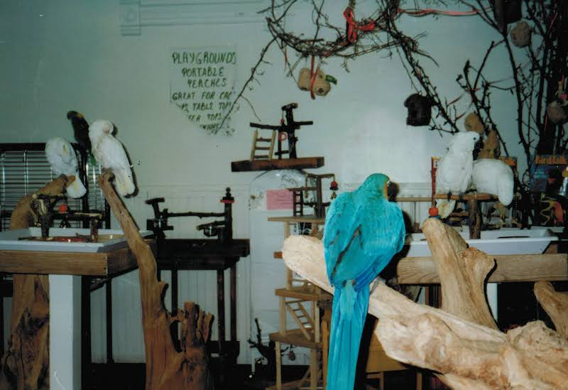
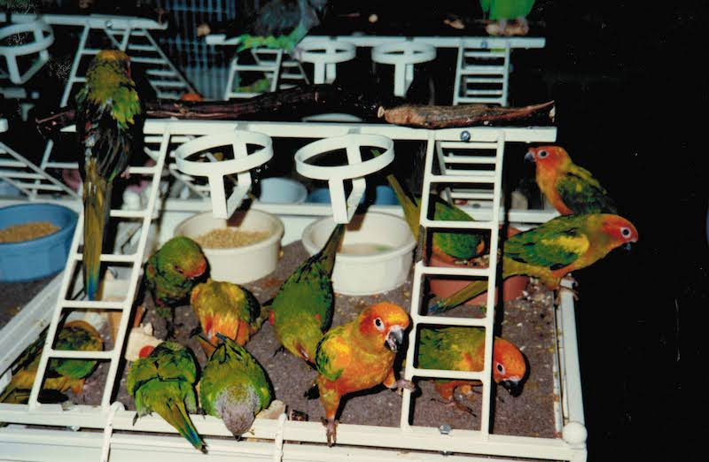
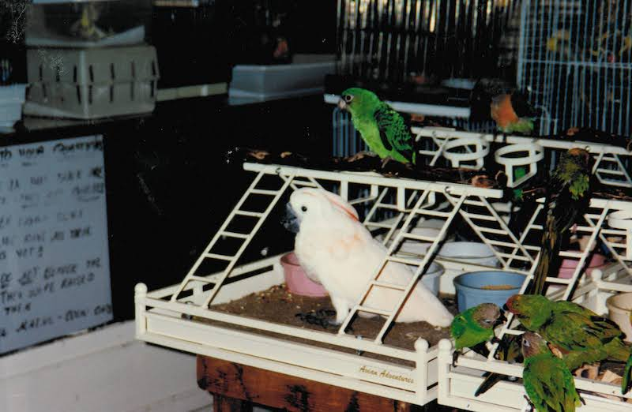
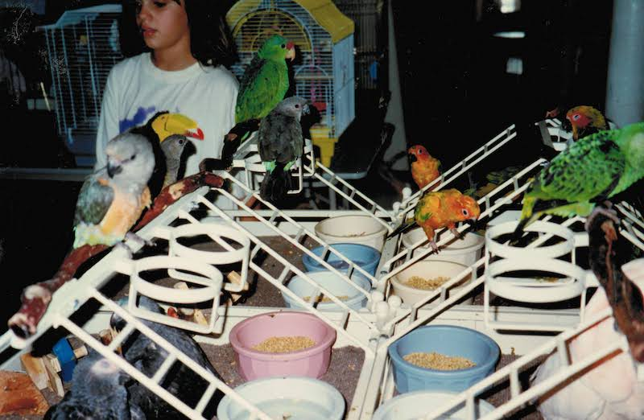
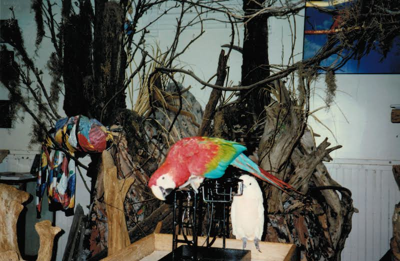
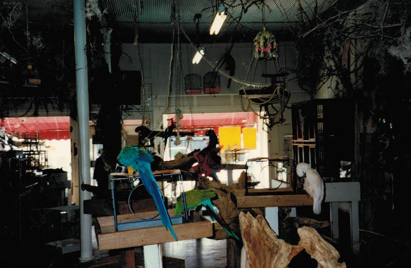

## Fly

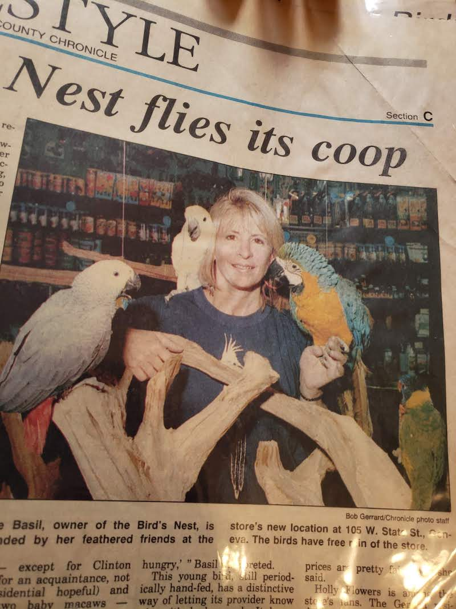

## Water

My whole life my entire existence I have lived with nature and interacted with God's nature creations.  I have spent my entire 78 years of life living with nature and on lakes-18 years on black lake, 2 on Indian lake and 27 years on Thayer Lake.  I am spiritually connected to God through his creation of nature and wildlife.  This is the reason I came to live on Thayer Lake.  Russ and I provided a sanctuary in the winter for waterlife by providing food for them so they could survive by the use of the bubbler.  We especially loved watching the eagles fish and the herons fish during the winter months.  The serenity of the water flowing, the ducks and loons swimming on the lake and diving down eating the vegetation during the winter months was a daily enjoyment for us.  The Michigan Department of Natural Resources personally thanked us for providing food and shelter for our wildlife during the winter months.  

Watching the ducks and loons swimming with their babies and watching them teach them how to bathe and dive for food was truly amazing, a daily pleasure and spiritually rewarding for us year after year. Watching the babies grow up into adults and fly away only to return the following year and do their mating ritual and dance was fascinating-and we got to witness this over and over.

Boating, fishing, water activities, ice skating and ice activity has always been a daily part of my life.  Watching birds take baths and swooping down to drink water, herons fishing and eagles fishing, ducks and loons and muskrats diving down to eat is truly fascinating especially in the winter months.  Deer in the winter, coming down to the water to drink.  Russ and I felt so blessed to live in such a wonderful place.  So peaceful and tranquil. The changing seasons,  watching the cycle of the lake go up and down over time - all of these things I wish everybody could grow up with.  I was very lucky to have this kind of life.  

This was our home for 27 years.  Russ truly loved this lake - every day waking up to an entire view of this beautiful lake from our kitchen and living room and bedroom was beyond our wildest dreams and we lived it.   His ashes were spread in this lake off our dock - this is his resting place as it also will be mine.

We loved watching  people boating, fishing, children playing in the water, ice skating in the winter, ice fishing and snowmobiling.   It was a daily part of our life and gave us great hours of pleasure and enjoyment.

- Grandma Shell

## Wave

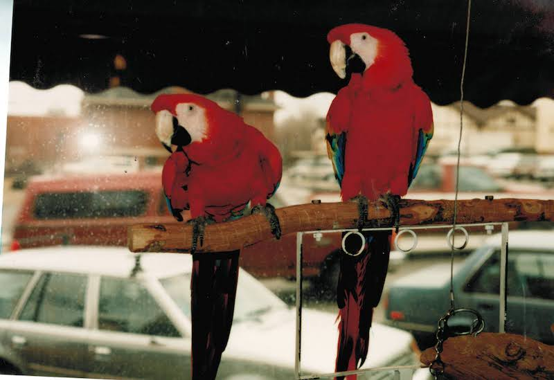

[🌿🌀🎨](https://link.basil.one)
