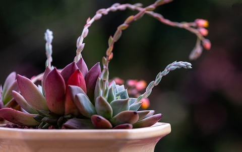

## [Shugyo](https://open.spotify.com/episode/40XeMBhJ3SNkIn5a28O4YD)

* Intense physical and spiritual training to be used for self-transformation

## Ki Principles

* Relax Completely
  * Drop unnecessary muscular tension allowing the spine to reveal itself
  * Like a flowing river, not a rigid rock
* Keep Weight Underside
  * Cultivate a heaviness in the hips, legs, and feet
  * Like a firmly anchored boat
* Keep One Point
  * Focus the mind's concentration on the center of the body's mass or lower navel
  * Like a tree with deep roots
* Extend Ki
  * Extend awareness in all directions
  * Like a lantern casting it's light, extend your energy

## Ranks

* [Unranked - White Level](./unranked)
* [8th Kyu - Orange Level](./kyu-8)
* [7.5 Kyu - Orange Level with One Stripe](./kyu-7.5)
* [7th Kyu - Orange Level with Two Stripes](./kyu-7)
* [6.5 Kyu - Blue Level](./kyu-6.5)
* [6th Kyu - Blue Level with One Stripe](./kyu-6)
* [5.5 Kyu - Blue Level with Two Stripes](./kyu-5.5)

## Demonstrations

* [March 2023 - Belt Testing - 8th Kyu: Jack and Dad](https://www.youtube.com/watch?v=VvirYiT8etI)
* [July 2023 - First Demonstration - Basil and Mizuno Kids](https://www.youtube.com/watch?v=bUbMgWkmlHw)
* [November 2023 - Belt Testing - 8th Kyu: Lila, 7.5 Kyu: Jack and Dad](https://youtu.be/_h4NeN6mOzk)
* [April 2024 - Belt Testing - 7.5 Kyu: Lila, 7th Kyu: Jack and Dad](https://youtu.be/fvchtViicBs)
* [August 2025 - Belt Testing - 5.5 Kyu: Jack and Dad](https://youtu.be/gzBvYnZ0McA)

## Arcs

* [Star Wars, George Lucas, Aikido, Ki and The Force](https://aikidoforbeginners.blogspot.com/2010/02/star-wars-george-lucas-aikido-ki-and.html)
* [Belt Testing](https://aikido-dojo.org/the-dojo/test-requirements/)
* [Chushinkan Dojo - Video Demonstrations](http://www.chushinkan.com/video.html)
* [Aikido of Northwest Kansas - Video Demonstrations](https://www.youtube.com/@aikidoofnorthwestkansas6804)
* [AikiWeb - The Source for Aikido Information](http://www.aikiweb.com/)
* [Aikido and the Dynamic Sphere](https://www.amazon.com/gp/product/0804832846/ref=ppx_yo_dt_b_search_asin_title)
* [Budo - Teachings of the Founder of Aikido](https://www.amazon.com/Budo-Teachings-Founder-Morihei-Ueshiba/dp/1568364873)
* [Zen Connections](https://isha.sadhguru.org/us/en/wisdom/article/zen-and-yoga)
* [Chosei Zen](https://www.choseizen.org/)
* [Fox Forrest Zen](https://www.foxforestzen.org/)
* [Fox Forrest Zen Podcast](https://open.spotify.com/show/7wSBxzCfYLePhUadRxX4Wh?si=8CHj5aCoS9uwTwoJsw4-zg)
* [Medicine and Sickness Cure Each Other - Gendo Osho](https://genjo.libsyn.com/medicine-and-sickness-cure-each-other)
* [Shugyo - Rick Testa Sensei (Gendo Osho)](https://open.spotify.com/episode/40XeMBhJ3SNkIn5a28O4YD)
* [Randori - Seizing Chaos](https://www.aikido411.com/aikido-techniques-randori-beauty-in-harmony-harmony-in-motion/)
* [Pathway to Harmony - Butler Sensei](http://pathwaytoharmony.com)
* [Okinaga breathing exercise](https://youtu.be/J_vvwSuISEk?si=NeWsMuTY0yjD4XOG)
* [Traditional Aikido Gi](https://tozandoshop.com/products/essential-cotton-aikido-uniform-set)

[🌿🌀🎨](https://basil.one)
