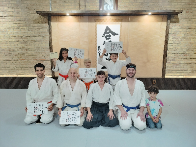

## 6.5 Kyu - Blue Belt

### Ki Exercises

[Happo Undo](https://www.youtube.com/watch?v=maiw6eHwAbU)

[Banzai No Kamae](https://www.youtube.com/watch?v=F_kaUjUb3_Q)

[Ushiro Ukemi](https://www.youtube.com/watch?v=Gpuu_t3M1aA)

### Response Techniques

[Yokomenuchi Kokyunage](https://www.youtube.com/watch?v=j31sQA3xSKA)

[Katatetori Kaitennage Irimi](https://youtu.be/K6FMIZUtHQE?si=sODi88-_8_2H3Skr)

[Katatetori Kaitennage Uchi](http://youtu.be/Dd6PsKCIW2E)

[Katatetori Kaitennage Soto](https://www.youtube.com/watch?v=owR55jYiTdE)

[Katatetori Kaitennage Tenkan](https://www.youtube.com/watch?v=9UTulCYqKp0)

[Ushirokatatori Kokyunage](https://youtu.be/vopP4xjGwks)

### Belt Testing

Community:

[🌿🌀🎨](https://link.basil.one)
