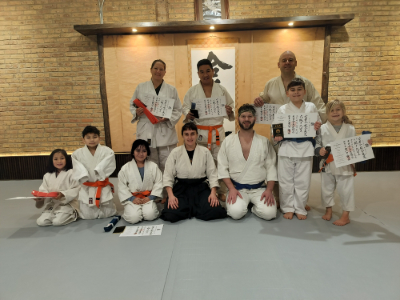
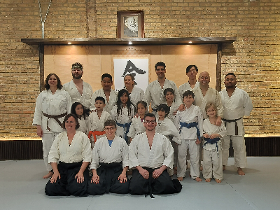

## 6th Kyu - Blue Belt with One Stripe

### Ki Exercises

[Tekubikosa Undo](https://www.youtube.com/watch?v=6t_QvU1AjME)

[Sayu Undo](https://www.youtube.com/watch?v=9Nuq4_2f_lk)

[Sayu Choyaku Undo](https://www.youtube.com/watch?v=eyZ4feGb4EI)

[Udefuri Undo](https://www.youtube.com/watch?v=XU9v-Rlo5jg )

[Udefuri Choyaku Undo](https://www.youtube.com/watch?v=IszX1fWqTHk)

### Response Techniques

[Yokomenuchi Shihonage Omote](https://www.youtube.com/watch?v=gBKhNFk_THA)

[Yokomenuchi Shihonage Ura](https://www.youtube.com/watch?v=lWlWkHNYo64)

[Ushirotekubitori Kokyunage Irimi](https://www.youtube.com/watch?v=XJDMpknI_bU)

[Ushirotekubitori Kokyunage Tenkan](https://www.youtube.com/watch?v=quz8SU25UKY)

[Shomenuchi Ikkyo Omote](https://www.youtube.com/watch?v=QnKTJ1E_yrk)

[Shomenuchi Ikkyo Ura](https://www.youtube.com/watch?v=tGTV5ro4wQE)

### Belt Testing

Community:

[🌿🌀🎨](https://link.basil.one)
