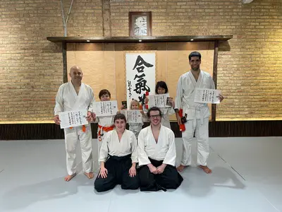
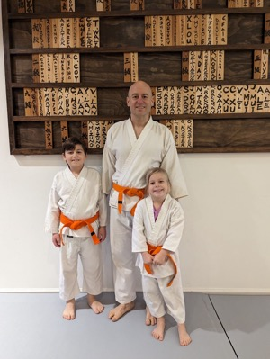
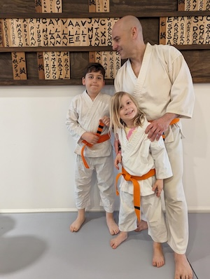
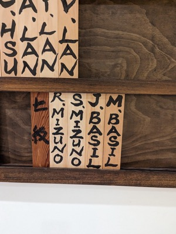

## 7.5 Kyu - Orange Belt with One Stripe

### Ki Exercises

[Shizentai](https://www.youtube.com/watch?v=p5jDEB8VLBw)

[Agura No Shisei](https://www.youtube.com/watch?v=MrACEN-MEhY)

[Funakogi Undo](https://www.youtube.com/watch?v=UN5azGRX3cs)

[Munetsuki](https://www.youtube.com/watch?v=dGaARvulpiM)

### Response Techniques

[Shomenuchi Kokyunage](https://www.youtube.com/watch?v=wIIf60uaYcM)

[Katatetori Shihonage Omote](https://www.youtube.com/watch?v=KSPsBjH_t1s)

[Katatetori Shihonage Ura](https://www.youtube.com/watch?v=iEXhbhSLEoo)

[Katatetori Nikyo Omote](https://www.youtube.com/watch?v=DSbaa9rzwYY)

[Katatetori Nikyo Ura](https://www.youtube.com/watch?v=ZzwkluvYgok)

### Belt Testing

Community:

Board:

Highlights:

* [November 2023 - Jack and Dad](https://youtu.be/_h4NeN6mOzk)
* [April 2024 - Lila](https://youtu.be/fvchtViicBs)

[🌿🌀🎨](https://link.basil.one)
