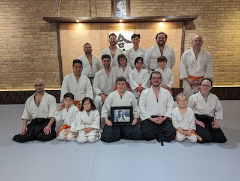
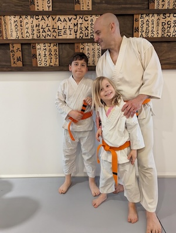

## 7th Kyu - Orange Belt with Two Stripes

### Ki Exercises

[Shomenuchi Ikkyo Undo](https://www.youtube.com/watch?v=PyVwydZGn-w)

[Zengo Undo](https://www.youtube.com/watch?v=FzqsXVxGthY)

[Mae Ukemi](https://www.youtube.com/watch?v=4Cr7lpSiayA)

[Yokomenuchi](http://youtu.be/EH92Ba4pcGA)

### Response Techniques

[Shomenuchi Kotegaeshi](https://www.youtube.com/watch?v=fjcRe8ewkBA)

[Shomenuchi Iriminage](https://www.youtube.com/watch?v=-q4VH0ZlB8M)

[Katatetori Sankyo Omote](https://www.youtube.com/watch?v=caDd3oXwx-Y)

[Katatetori Sankyo Ura](https://www.youtube.com/watch?v=o5gPmSyx1w4)

[Munetsuki Kotegaeshi](https://www.youtube.com/watch?v=WGZOvYM2hmQ)

### Belt Testing

Community:

Board:

Highlights:

* [April 2024 - Jack and Dad](https://youtu.be/fvchtViicBs)

[🌿🌀🎨](https://link.basil.one)
