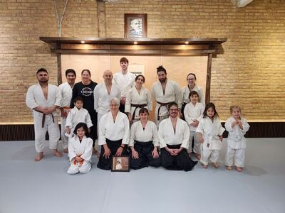
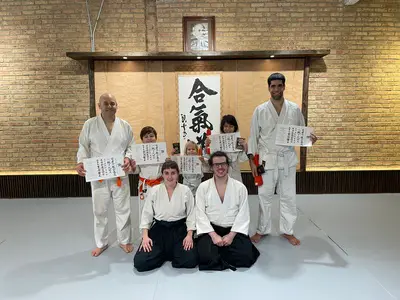
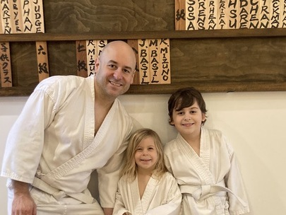

## 8th Kyu - Orange Level

### Ki Exercises

[Bowing](https://www.youtube.com/watch?v=5K2riEjHzpE)

[Seiza](https://www.youtube.com/watch?v=bbFI5vFfEmQ)

[Hanmi No Kamae](https://www.youtube.com/watch?v=dgn5r6kyr1M)

[Orenaite](https://www.youtube.com/watch?v=JB4AB5Tjl9o)

[Koho Tento Undo](https://www.youtube.com/watch?v=glR1991blKE)

[Shomenuchi](https://www.youtube.com/watch?v=C2jKX2NuYsQ)

### Response Techniques

[Katatori Ikkyo Omote](https://www.youtube.com/watch?v=ZRhE35jsNNk)

[Katatori Ikkyo Ura](https://www.youtube.com/watch?v=IaTAiQkVoVc)

[Katatekosatori Kokyunage](https://www.youtube.com/watch?v=Zzk_lCVvqdM)

[Katatekosatori Kotegaeshi](https://www.youtube.com/watch?v=t_p1sowf5vM)

### Belt Testing

Community:

Board:

Highlights:

* [March 2023 - Jack and Dad](https://www.youtube.com/watch?v=VvirYiT8etI)
* [November 2023 - Lila](https://youtu.be/_h4NeN6mOzk)

[🌿🌀🎨](https://link.basil.one)
