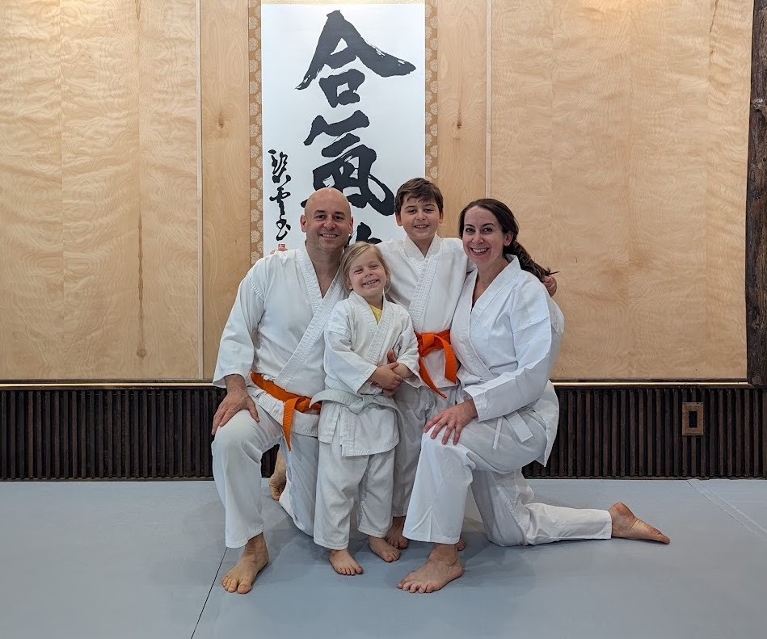

## Ignition

[...](https://www.youtube.com/watch?v=5C2TpVrPM6Y)

## Vehicle

[...](https://www.youtube.com/watch?v=MFzDaBzBlL0)

## Rearview

[...](https://youtu.be/lXmHA-XySmk)

* Clear mirror feels nice, however ...
* Fast approaching bulls reveal unexpected opportunities

## Wheel

[...](https://youtu.be/vf1etlfrXmY)

| Degree | Phase/Gear | Induction |
| - | - | - |
| 0° | Isolation | [Teen Spirit](https://www.youtube.com/watch?v=hTWKbfoikeg) |
| 90° | Interconnection | [Spoon is Neo](https://www.youtube.com/watch?v=uAXtO5dMqEI) |
| 180° | Cultivation | [Release Mirror](https://www.youtube.com/watch?v=Jt5qjtItucw) |
| 270° | Freedom | [Free Bird](https://www.youtube.com/watch?v=0LwcvjNJTuM) |
| 360° | Universal | [Walking Line](https://www.youtube.com/watch?v=J-6fW66IUY4) |

### Coop

[...](https://www.youtube.com/watch?v=JBiUZyb2Ab8)

| Phase/Gear | Formula | Caption |
| - | - | - |
| Isolation | 1+2=3 | An acorn fell on my head, sky is falling! |
| Interconnection | 0=1=♾️ | The acorn, the sky, my head are one |
| Cultivation | 1000x0=0 | ... |
| Freedom | 1+2=* | Acorn is mischievous, head skowls, sky laughs |
| Universal | 3x3=9 | Acorns fall, head bumps heal, sky is blue |

### Herd

[...](https://terebess.hu/english/Kuoan1.html)

| Phase/Gear | Caption |
| - | - |
| Isolation| Searching for the Ox |
| Isolation | Seeing the Traces |
| Isolation | Seeing the Ox |
| Interconnection | Catching the Ox |
| Interconnection | Herding the Ox |
| Interconnection | Coming Home on the Ox's Back |
| Cultivation | The Ox Forgotten, Leaving the Man Alone |
| Cultivation  | The Ox and the Man Both Gone out of Sight |
| Freedom | Returning to the Origin, Back to the Source |
| Universal | Entering the City with Bliss-bestowing Hands |

## Filter

[...](https://www.youtube.com/watch?v=8xUq-vLzZEg)

| Dimension | Isolation | Interconnection | Cultivation | Freedom | Universal |
| - | - | - | - | - | - |
| Experience | Sparring | Song | ... | Flying | Cycling |
| Cognition | Dramatic | Prospective | Undialed | Alive | Retrospective |
| Emotion | Crutch | Bond | Background | Wave | Reflection |
| Attraction | Outer | Inter | Autophagy | Expansion | Inner |
| Orientation | Selfish | Selfless | Releasing | Seeking | Accepting |
| Action | Impulsive | Harmonious | Regenerative | Passionate | Reflexive |
| Scale | Transactional | Spatial | Void | Fluid | Universal |

## Lockout

[...](https://www.youtube.com/watch?v=WTMcoh8XROI)

* Fearing ***Uncertainty***
* Feeling ***Insecure***
* Fronting ***Countermeasures***

## Perception

[...](https://www.youtube.com/watch?v=xXYhua4IwoE)

* ***Inner***: See from inside reflecting off everything else
* ***Full***: Listen through the eyes and emotinal ears of those involved
* ***Aware***: Consider metaphorical filters that shape reality and trends

## Circuitry

[...](https://www.youtube.com/watch?v=ZUxuQC1Ec2A)

* Influence polarity and volume of energy through the ***Amygdala***
* Flow energy through prefrontal cortex to increase ***Creativity***
* Practice mind, body and breath centric methods to increase ***Agility***

## Gravitation

[...](https://www.youtube.com/watch?v=4aN5TbGW5JA)

* Contemplative ***Unpacking***
* Situational ***Rehersals***
* ***Inflection*** Exercise

## Bamboo

[...](https://youtu.be/9g8T8MsFIp0)

## Zen

* When inside and outside become one, no circumstances can hinder us
* We engineer our experience as a function of practical action and attitude

[...](https://www.youtube.com/watch?v=T_3HiknOtBY)

[🌿🌀🎨](https://link.basil.one)
